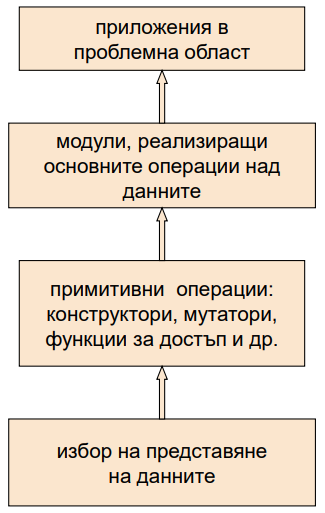

# Agenda Week 02

## Moodle course
Key = OOP2018

## `class` vs `struct`
### Access modifiers
* `public`
* `private`
* `protected`
### Member variables (fields)
### Member functions (methods)
* Setters and getters
* Another `const` usage
### `this` pointer
https://www.geeksforgeeks.org/this-pointer-in-c/
### Splitting definition from implementation
Abstraction using classes
Abstraction using header files

## Let's code our first class
using the abstraction scheme from lectures

### `class BankAccount`

with the following fields
* Bank account holder name 
* Bank account ID
* Balance

and the following methods
* Withdraw
* Deposit
* Initialize
* Print

Define functions that operate on `BankAccount` 
* Merge
* Get the min/max of array by balance